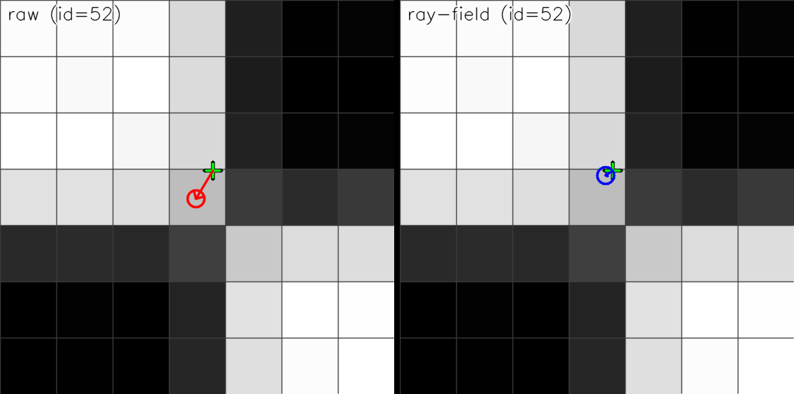
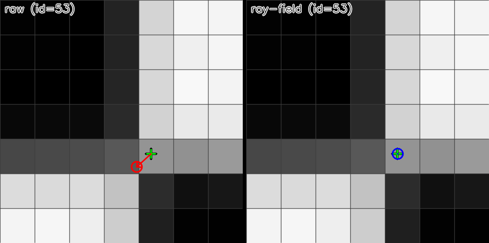

# StereoComplex

Stereo calibration and 3D reconstruction research prototype, built around:

- a CPU synthetic-data generator (digital twins) for stereo + ChArUco,
- a 2D “ray-field” correction (homography + smooth residual field) to improve ChArUco corner localization,
- an experimental **ray-based 3D reconstruction / calibration** prototype (central ray-field, Zernike basis) designed as a stepping stone towards complex/non-pinhole optics.

## Why would you use this?

StereoComplex targets two practical pain points:

- **Fix OpenCV calibration that plateaus** (blur / distortion / compression): refine ChArUco corners before calibration (without assuming a global pinhole model for the refinement).
- **Reconstruct 3D without a pinhole model (prototype)**: calibrate a compact ray-based stereo model from multi-pose planar observations (**no solvePnP, no known** `K`) and triangulate from rays.

Visual proof (green = GT, red = OpenCV raw, blue = ray-field):




## Highlights (from the provided examples)

- **2D ChArUco accuracy improvement (example)**: RMS corner error drops from ~0.357 px → ~0.219 px (left) and ~0.356 px → ~0.153 px (right) with the 2D ray-field correction.
- **OpenCV stereo calibration impact (example)**: feeding OpenCV with ray-field-corrected corners improves mono RMS (~0.306/0.302 px → ~0.079/0.061 px), improves stereo RMS (~0.381 px → ~0.163 px), and reduces baseline error in disparity-equivalent pixels (~0.424 px → ~0.205 px).
- **3D without a pinhole model (prototype)**: a central ray-field can be calibrated from multi-pose planar observations by a point↔ray bundle adjustment (**no solvePnP, no known** `K`), then used to triangulate points.

See `docs/RAYFIELD_WORKED_EXAMPLE.md` and `docs/STEREO_RECONSTRUCTION.md` for full methodology, plots, and definitions.

## Alternatives and positioning

StereoComplex is designed to sit between minimal OpenCV calibration scripts and larger robotics / SfM toolchains.
It keeps an OpenCV-like installation footprint, but emphasizes robust stereo geometry, rectification quality, and explicit diagnostic metrics.

**OpenCV (camera & stereo calibration).** A widely used baseline: easy to install, stable APIs, strong documentation. In practice, performance can plateau on degraded data (blur, compression, noise), and OpenCV provides limited diagnostics beyond reprojection error. StereoComplex is compatible with OpenCV workflows and adds geometric corner refinement + explicit metrics on top. References: [opencv.org](https://opencv.org/), [opencv/opencv](https://github.com/opencv/opencv), [opencv/opencv_contrib](https://github.com/opencv/opencv_contrib).

**Kalibr (ETH Zurich).** A robotics-oriented calibration toolbox (camera/IMU) with rich models and global optimization. For stereo-only workflows, the ROS/catkin/Docker-style setup can be heavy. StereoComplex targets lightweight stereo calibration without requiring a robotics stack. Reference: [ethz-asl/kalibr](https://github.com/ethz-asl/kalibr).

**Basalt (TUM).** A VIO/SLAM research framework that includes calibration tools and modern optimization. It is primarily a C++ VIO codebase with non-trivial build/configuration, and calibration is not a standalone focus. StereoComplex focuses specifically on stereo geometry and rectification quality. Reference: [VladyslavUsenko/basalt](https://github.com/VladyslavUsenko/basalt).

**camodocal.** An academic multi-camera calibration toolbox with solid foundations and multiple camera models. It tends to have lower maintenance activity and dated ergonomics compared to newer pipelines. StereoComplex focuses on a lightweight Python workflow with reproducible experiments and diagnostics. Reference: [hengli/camodocal](https://github.com/hengli/camodocal).

**SfM toolchains (COLMAP, OpenMVG).** Excellent for reconstruction from unordered imagery, but not designed around stereo calibration objectives (stereo constraints and rectification quality are not first-class targets). They can provide rough initialization in unconstrained settings, but are out of scope here. References: [colmap.github.io](https://colmap.github.io/) / [colmap/colmap](https://github.com/colmap/colmap), [openMVG/openMVG](https://github.com/openMVG/openMVG).

**Non-goals (current scope).**

- Not a SLAM or VIO framework
- Not a camera–IMU calibration toolbox
- Not a replacement for full robotics stacks
- Not a Structure-from-Motion pipeline

## Installation

Core dependencies are in `pyproject.toml` (NumPy, Pillow, SciPy). For ChArUco/ArUco features, you also need OpenCV with `aruco`:

- recommended: `opencv-contrib-python` (provides `cv2.aruco`).

Editable install:

```bash
.venv/bin/python -m pip install -e .
```

## Quickstart (CPU dataset generator)

CLI help:

```bash
.venv/bin/python -m stereocomplex.cli --help
```

Generate a minimal synthetic dataset:

```bash
.venv/bin/python -m stereocomplex.cli generate-cpu-dataset --out dataset/v0 --scenes 2 --frames-per-scene 16 --width 640 --height 480
```

ChArUco + blur (e.g., 8 µm FWHM):

```bash
.venv/bin/python -m stereocomplex.cli generate-cpu-dataset --out dataset/charuco_blur --pattern charuco --blur-fwhm-um 8
```

Stronger edge blur (variable PSF approximation):

```bash
.venv/bin/python -m stereocomplex.cli generate-cpu-dataset --out dataset/charuco_edgeblur --pattern charuco --blur-fwhm-um 6 --blur-edge-factor 3 --blur-edge-start 0.5
```

Texture interpolation (anti-alias):

```bash
.venv/bin/python -m stereocomplex.cli generate-cpu-dataset --out dataset/charuco_interp --pattern charuco --tex-interp lanczos4
```

Geometric aberrations (distortion):

```bash
.venv/bin/python -m stereocomplex.cli generate-cpu-dataset --out dataset/charuco_dist --pattern charuco --distort brown --distort-strength 0.5
```

Black background outside the board + lossless WebP:

```bash
.venv/bin/python -m stereocomplex.cli generate-cpu-dataset --out dataset/charuco_webp_black --pattern charuco --image-format webp --outside-mask hard
```

Validate dataset consistency:

```bash
.venv/bin/python -m stereocomplex.cli validate-dataset dataset/v0
```

Oracle eval (synthetic sanity check: very small reprojection/triangulation errors expected):

```bash
.venv/bin/python -m stereocomplex.cli eval-oracle dataset/v0
```

Note: if you prefer not to install the package, you can prefix commands with `PYTHONPATH=src`.

## Quickstart (fix OpenCV calibration on a dataset scene)

Export refined ChArUco corners (JSON + an OpenCV-ready NPZ):

```bash
.venv/bin/python -m stereocomplex.cli refine-corners dataset/v0_png --split train --scene scene_0000 \
  --method rayfield_tps_robust \
  --out-json paper/tables/refined_corners_scene0000.json \
  --out-npz paper/tables/refined_corners_scene0000_opencv.npz
```

## Quickstart (3D reconstruction without a pinhole model)

Calibrate a central ray-field stereo model (point↔ray bundle adjustment) and export it:

```bash
.venv/bin/python paper/experiments/calibrate_central_rayfield3d_from_images.py dataset/v0_png \
  --split train --scene scene_0000 --max-frames 5 \
  --method2d rayfield_tps_robust \
  --nmax 10 --lam-coeff 1e-3 --outer-iters 3 \
  --out paper/tables/rayfield3d_ba_scene0000.json \
  --export-model models/scene0000_rayfield3d
```

Then triangulate with the exported model (API demo):

```bash
.venv/bin/python docs/examples/reconstruction_api_demo.py dataset/v0_png \
  --split train --scene scene_0000 --max-frames 5 \
  --model models/scene0000_rayfield3d
```

## Documentation

Start here:

- `docs/START_HERE.md`
- `docs/ARCHITECTURE.md`
- `docs/DATASET_SPEC.md`
- `docs/CONVENTIONS.md`

Core method pages:

- `docs/CHARUCO_IDENTIFICATION.md`
- `docs/FIX_MY_CALIBRATION.md`
- `docs/RAYFIELD_WORKED_EXAMPLE.md`
- `docs/STEREO_RECONSTRUCTION.md`
- `docs/RAYFIELD3D_RECONSTRUCTION.md`
- `docs/RECONSTRUCTION_API.md`

### Sphinx / ReadTheDocs

Build local HTML docs:

```bash
.venv/bin/python -m pip install -e .[docs]
make -C docs html
```

Build PDF (LaTeX):

```bash
make -C docs latexpdf
```

## Minimal Python API (model → triangulation)

```python
import numpy as np
import stereocomplex as sc

model = sc.load_stereo_central_rayfield("models/scene0000_rayfield3d")
uvL = np.array([[320.0, 240.0]], dtype=float)
uvR = np.array([[318.5, 240.0]], dtype=float)
XYZ_L_mm, skew_mm = model.triangulate(uvL, uvR)
```
