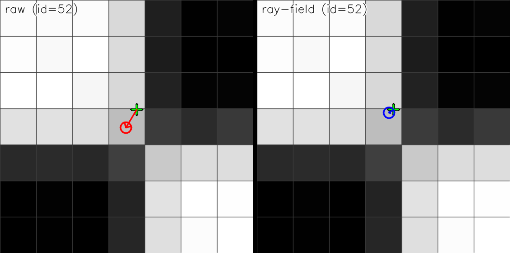
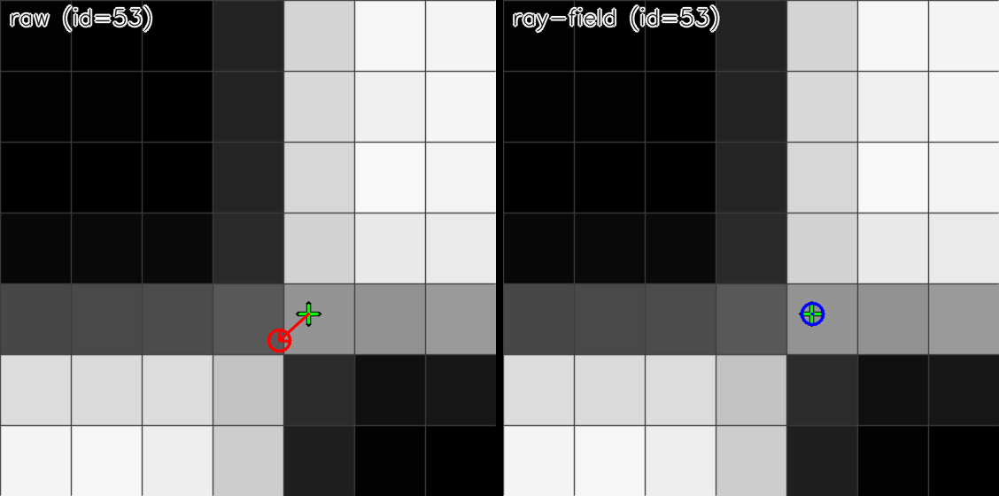

# StereoComplex

Lightweight Python toolkit for robust stereo calibration and ray-based 3D
reconstruction, built around:

- a CPU synthetic-data generator (digital twins) for stereo + ChArUco,
- practical ChArUco workflows: detect, refine, compare raw OpenCV against Ray2D,
  and export OpenCV-ready data,
- an experimental **central ray-based 3D reconstruction / calibration** backend,
- an experimental **non-central Zernike origin-field** backend where each pixel
  maps to a 3D line rather than to a ray emitted from one fixed pinhole center.

Note on terminology: in this repository, “ray-field” has three precise uses:

| Term | Meaning | Status |
| --- | --- | --- |
| Ray2D / planar ray-field | Homography + smooth residual field on the calibration board plane | stable practical preprocessing |
| Central 3D ray-field | Pixel → 3D direction, shared camera center | experimental |
| Non-central 3D rayfield | Pixel → 3D line `(O(u,v), d(u,v))` | experimental |

The 2D Ray2D method is not itself a 3D non-central camera model. It improves the
image observations fed to calibration.

## Why would you use this?

StereoComplex targets two practical pain points:

- In many practical stereo systems, calibration accuracy is limited by **2D localization quality** (blur, compression, noise) rather than by the camera model itself.
- **Fix OpenCV calibration that plateaus** (blur / distortion / compression): refine ChArUco corners before calibration (without assuming a global pinhole model for the refinement).
- **Reconstruct 3D without a pinhole model (prototype)**: calibrate a compact ray-based stereo model from multi-pose planar observations (**no solvePnP, no known** `K`) and triangulate from rays.
- **Test non-central stereo assumptions (prototype)**: fit a Zernike origin field
  `O(u,v)` when a protective glass, inclined window, thick optical stack, or
  other non-central effect leaves systematic ray gaps.

Engineering footprint: no ROS, no Docker requirement, no C++ toolchain; the core is a Python package using standard scientific libraries.

Visual proof (green = GT, red = OpenCV raw, blue = ray-field):




## Key contributions

1. **Robust ChArUco refinement without requiring a camera model**:
   `rayfield_tps_robust` uses a homography plus a smooth residual field on the
   board plane.
2. **OpenCV-compatible stereo calibration diagnostics**: compare raw/refined
   ChArUco points, export OpenCV-ready data, and report reconstruction metrics.
3. **Central 3D ray-field reconstruction**: learn a compact pixel-to-ray
   direction model and triangulate from rays.
4. **Experimental non-central stereo calibration**: fit a Zernike origin field
   `O(u,v)` so pixels define 3D lines instead of sharing one optical center.
5. **Synthetic non-central oracle benchmark**: use an inclined parallel-plate
   generator as a physical oracle without fitting the plate parameters.
6. **Practical non-central image workflow**: fit a Zernike origin-field model
   directly from two image folders.

## Key result: 3D ray-field is remarkably stable under compression

On a synthetic benchmark where we sweep codec quality, the **3D ray-field reconstruction** remains stable under lossy compression, while pinhole-based pipelines remain sensitive to compression artifacts through the 2D localization stage.


## Key result: non-central rendered-image benchmark

On the inclined-plate benchmark, raw OpenCV ChArUco detections impose a high
reconstruction floor. With Ray2D-refined observations, the same non-central BA
reaches sub-millimetric reconstruction accuracy:

| Front-end | Central RMS | Oracle-detected RMS | Non-central BA RMS |
| --- | ---: | ---: | ---: |
| OpenCV raw | ~4.21 mm | ~3.44 mm | ~3.36 mm |
| Ray2D refined | ~2.50 mm | ~0.76 mm | ~0.66 mm |

Interpretation: the non-central model works when the 2D observations are good
enough; front-end quality is the limiting factor on rendered or real images.

## Highlights (from the provided examples)

- **2D ChArUco accuracy improvement (example)**: RMS corner error drops from ~0.357 px → ~0.219 px (left) and ~0.356 px → ~0.153 px (right) with the 2D ray-field correction.
- **OpenCV stereo calibration impact (example)**: feeding OpenCV with ray-field-corrected corners improves mono RMS (~0.306/0.302 px → ~0.079/0.061 px), improves stereo RMS (~0.381 px → ~0.163 px), and reduces baseline error in disparity-equivalent pixels (~0.424 px → ~0.205 px).
- **3D without a pinhole model (prototype)**: a central ray-field can be calibrated from multi-pose planar observations by a point↔ray bundle adjustment (**no solvePnP, no known** `K`), then used to triangulate points (and shows strong robustness to lossy compression in the provided compression sweep).
- **Non-central stereo (experimental)**: a Zernike origin-field backend fits
  `O(u,v)` from image folders and is validated on an inclined parallel-plate
  oracle benchmark.

See `docs/RAYFIELD_WORKED_EXAMPLE.md` and `docs/STEREO_RECONSTRUCTION.md` for full methodology, plots, and definitions.

## Alternatives and positioning

StereoComplex is designed to sit between minimal OpenCV calibration scripts and larger robotics / Structure-from-Motion (SfM) toolchains.
It keeps an OpenCV-like installation footprint, but emphasizes robust stereo geometry, rectification quality, and explicit diagnostic metrics.

**OpenCV (camera & stereo calibration).** A widely used baseline: easy to install, stable APIs, strong documentation. In practice, performance can plateau on degraded data (blur, compression, noise), and OpenCV provides limited diagnostics beyond reprojection error. StereoComplex is compatible with OpenCV workflows and adds geometric corner refinement + explicit metrics on top. References: [opencv.org](https://opencv.org/), [opencv/opencv](https://github.com/opencv/opencv), [opencv/opencv_contrib](https://github.com/opencv/opencv_contrib).

**Kalibr (ETH Zurich).** A robotics-oriented calibration toolbox (camera / inertial measurement unit (IMU)) with rich models and global optimization. For stereo-only workflows, the Robot Operating System (ROS) / catkin / Docker-style setup can be heavy. StereoComplex targets lightweight stereo calibration without requiring a robotics stack. Reference: [ethz-asl/kalibr](https://github.com/ethz-asl/kalibr).

**Basalt (TUM).** A visual-inertial odometry (VIO) / simultaneous localization and mapping (SLAM) research framework that includes calibration tools and modern optimization. It is primarily a C++ VIO codebase with non-trivial build/configuration, and calibration is not a standalone focus. StereoComplex focuses specifically on stereo geometry and rectification quality. Reference: [VladyslavUsenko/basalt](https://github.com/VladyslavUsenko/basalt).

**camodocal.** An academic multi-camera calibration toolbox with solid foundations and multiple camera models. It tends to have lower maintenance activity and dated ergonomics compared to newer pipelines. StereoComplex focuses on a lightweight Python workflow with reproducible experiments and diagnostics. Reference: [hengli/camodocal](https://github.com/hengli/camodocal).

**Structure-from-Motion (SfM) toolchains (COLMAP, OpenMVG).** Excellent for reconstruction from unordered imagery, but not designed around stereo calibration objectives (stereo constraints and rectification quality are not first-class targets). They can provide rough initialization in unconstrained settings, but are out of scope here. References: [colmap.github.io](https://colmap.github.io/) / [colmap/colmap](https://github.com/colmap/colmap), [openMVG/openMVG](https://github.com/openMVG/openMVG).

**Non-goals (current scope).**

- Not a SLAM or VIO framework
- Not a camera–IMU calibration toolbox
- Not a replacement for full robotics stacks
- Not a Structure-from-Motion pipeline

## Installation

Core dependencies are in `pyproject.toml` (NumPy, Pillow, SciPy, OpenCV ArUco).
If you want the walkthrough notebooks, install the notebook extra too:

```bash
.venv/bin/python -m pip install -e '.[notebooks]'
```

Editable install:

```bash
.venv/bin/python -m pip install -e .
```

## Quickstart (CPU dataset generator)

CLI help:

```bash
.venv/bin/python -m stereocomplex.cli --help
```

Generate a minimal synthetic dataset:

```bash
.venv/bin/python -m stereocomplex.cli generate-cpu-dataset --out dataset/v0 --scenes 2 --frames-per-scene 16 --width 640 --height 480
```

ChArUco + blur (e.g., 8 µm FWHM):

```bash
.venv/bin/python -m stereocomplex.cli generate-cpu-dataset --out dataset/charuco_blur --pattern charuco --blur-fwhm-um 8
```

Stronger edge blur (variable PSF approximation):

```bash
.venv/bin/python -m stereocomplex.cli generate-cpu-dataset --out dataset/charuco_edgeblur --pattern charuco --blur-fwhm-um 6 --blur-edge-factor 3 --blur-edge-start 0.5
```

Texture interpolation (anti-alias):

```bash
.venv/bin/python -m stereocomplex.cli generate-cpu-dataset --out dataset/charuco_interp --pattern charuco --tex-interp lanczos4
```

Geometric aberrations (distortion):

```bash
.venv/bin/python -m stereocomplex.cli generate-cpu-dataset --out dataset/charuco_dist --pattern charuco --distort brown --distort-strength 0.5
```

Black background outside the board + lossless WebP:

```bash
.venv/bin/python -m stereocomplex.cli generate-cpu-dataset --out dataset/charuco_webp_black --pattern charuco --image-format webp --outside-mask hard
```

Validate dataset consistency:

```bash
.venv/bin/python -m stereocomplex.cli validate-dataset dataset/v0
```

Oracle eval (synthetic sanity check: very small reprojection/triangulation errors expected):

```bash
.venv/bin/python -m stereocomplex.cli eval-oracle dataset/v0
```

Note: if you prefer not to install the package, you can prefix commands with `PYTHONPATH=src`.

## Quickstart (fix OpenCV calibration on a dataset scene)

Export refined ChArUco corners (JSON + an OpenCV-ready NPZ):

```bash
.venv/bin/python -m stereocomplex.cli refine-corners dataset/v0_png --split train --scene scene_0000 \
  --method rayfield_tps_robust \
  --out-json paper/tables/refined_corners_scene0000.json \
  --out-npz paper/tables/refined_corners_scene0000_opencv.npz
```

## Quickstart (3D reconstruction without a pinhole model)

### Bring your own stereo folders (public API)

If you already have `left/*.png`, `right/*.png`, and a known ChArUco board:

First, if you just want to keep a standard OpenCV workflow and compare raw
corners against `Ray2D + OpenCV`:

```python
import stereocomplex as sc

board = sc.CharucoBoardSpec(
    squares_x=11,
    squares_y=7,
    square_size_mm=39.0713,
    marker_size_mm=27.3499,
    aruco_dictionary="DICT_4X4_1000",
)

raw = sc.fit_opencv_stereo_from_image_dirs(
    left_dir="my_data/left",
    right_dir="my_data/right",
    board=board,
    method2d="raw",
)
refined = sc.fit_opencv_stereo_from_image_dirs(
    left_dir="my_data/left",
    right_dir="my_data/right",
    board=board,
    method2d="rayfield_tps_robust",
)
```

Then, if you want the StereoComplex 3D backend instead of a pinhole model:

```python
from pathlib import Path

import stereocomplex as sc

board = sc.CharucoBoardSpec(
    squares_x=11,
    squares_y=7,
    square_size_mm=39.0713,
    marker_size_mm=27.3499,
    aruco_dictionary="DICT_4X4_1000",
)

result = sc.fit_stereo_central_rayfield_from_image_dirs(
    left_dir=Path("my_data/left"),
    right_dir=Path("my_data/right"),
    board=board,
    method2d="rayfield_tps_robust",
    export_model_dir=Path("models/my_calibration"),
)
```

Then load and triangulate:

```python
model = sc.load_stereo_central_rayfield("models/my_calibration")
XYZ_mm, skew_mm = model.triangulate(uvL, uvR)
```

See `docs/BRING_YOUR_OWN_DATA.md` for the step-by-step walkthrough.

### Non-central stereo from image folders (experimental)

If a central/pinhole model leaves systematic ray gaps or reconstruction bias,
fit a Zernike origin field directly from two image folders:

```python
from pathlib import Path

import stereocomplex as sc

board = sc.CharucoBoardSpec(
    squares_x=9,
    squares_y=6,
    square_size_mm=20.0,
    marker_size_mm=15.0,
    aruco_dictionary="DICT_4X4_50",
)

fit = sc.fit_stereo_zernike_origin_field_from_image_dirs(
    left_dir=Path("my_data/left"),
    right_dir=Path("my_data/right"),
    board=board,
    max_order=4,
    method2d="rayfield_tps_robust",
)

print(fit.residual_rms)
left_field = fit.left_field
right_field = fit.right_field
```

Use `examples/notebooks/05_noncentral_calibration_from_images.ipynb` for the
practical workflow, and `examples/notebooks/04_parallel_plate_origin_field.ipynb`
for the controlled scientific benchmark.

Current non-central status: experimental. It requires diverse board poses,
depends strongly on 2D detection quality, and higher Zernike orders need more
data. Check train/test poses and support-aware rayfield metrics before claiming
deployment-grade calibration.

### Dataset v0 scene (public API)

The stable public API wrapper for the versioned sample scene is:

```python
from pathlib import Path
import stereocomplex as sc

result = sc.fit_stereo_central_rayfield_from_dataset(
    dataset_root="dataset/v0_png",
    split="train",
    scene="scene_0000",
    max_frames=5,
    method2d="rayfield_tps_robust",
    nmax=10,
    export_model_dir=Path("models/scene0000_rayfield3d"),
)
```

### Internal paper script (advanced / reproducibility)

Calibrate a central ray-field stereo model (point↔ray bundle adjustment) and export it:

```bash
.venv/bin/python paper/experiments/calibrate_central_rayfield3d_from_images.py dataset/v0_png \
  --split train --scene scene_0000 --max-frames 5 \
  --method2d rayfield_tps_robust \
  --nmax 10 --lam-coeff 1e-3 --outer-iters 3 \
  --out paper/tables/rayfield3d_ba_scene0000.json \
  --export-model models/scene0000_rayfield3d
```

Then triangulate with the exported model (API demo):

```bash
.venv/bin/python docs/examples/reconstruction_api_demo.py dataset/v0_png \
  --split train --scene scene_0000 --max-frames 5 \
  --model models/scene0000_rayfield3d
```

## Documentation

Start here:

- `docs/START_HERE.md`
- `docs/ARCHITECTURE.md`
- `docs/DATASET_SPEC.md`
- `docs/CONVENTIONS.md`

Core method pages:

- `docs/CHARUCO_IDENTIFICATION.md`
- `docs/FIX_MY_CALIBRATION.md`
- `docs/RAYFIELD_WORKED_EXAMPLE.md`
- `docs/STEREO_RECONSTRUCTION.md`
- `docs/RAYFIELD3D_RECONSTRUCTION.md`
- `docs/RECONSTRUCTION_API.md`
- `docs/BRING_YOUR_OWN_DATA.md`

## Example notebooks

If you prefer a guided, executable walkthrough, start with:

- `examples/notebooks/01_ray2d_vs_opencv.ipynb` and `examples/notebooks/01_ray2d_vs_opencv.py`
- `examples/notebooks/02_ray3d.ipynb` and `examples/notebooks/02_ray3d.py`
- `examples/notebooks/03_rayfield_virtual_rectification.ipynb` and `examples/notebooks/03_rayfield_virtual_rectification.py`

The notebooks are intentionally lightweight: they read the committed synthetic images and JSON summaries already present in the repository, including the two small sample scenes versioned under
`dataset/compression_sweep_pnp/png_lossless/train/scene_0000` and `dataset/v0_png/train/scene_0000`.
After `pip install -e '.[notebooks]'`, the repo includes the Jupyter stack needed to open them with `jupyter lab examples/notebooks`.

## Code & documentation

The full toolkit is available on GitHub (`https://github.com/jeffwitz/StereoComplex`), and the online documentation is published via ReadTheDocs (`https://stereocomplex.readthedocs.io/en/latest/`), so you can browse tutorials and references without cloning the repo.

### Sphinx / ReadTheDocs

Build local HTML docs:

```bash
.venv/bin/python -m pip install -e .[docs]
make -C docs html
```

Run the local validation suite before committing:

```bash
bash scripts/validate_local.sh
```

If you want the script to reinstall editable dependencies first, set `VALIDATE_INSTALL=1`.

Serve the HTML docs locally (needed to render the embedded YouTube video in the docs, and so the root URL opens the docs directly):

```bash
.venv/bin/python -m http.server -d docs/_build/html 8000
```

Then open `http://localhost:8000/`.

Build PDF (LaTeX):

```bash
make -C docs latexpdf
```

## Minimal Python API (model → triangulation)

```python
import numpy as np
import stereocomplex as sc

model = sc.load_stereo_central_rayfield("models/scene0000_rayfield3d")
uvL = np.array([[320.0, 240.0]], dtype=float)
uvR = np.array([[318.5, 240.0]], dtype=float)
XYZ_L_mm, skew_mm = model.triangulate(uvL, uvR)
```

## License

- Code: GNU General Public License v2.0 or later (GPL-2.0-or-later), see `LICENSE`.
- Documentation (`docs/`): Creative Commons Attribution-ShareAlike 4.0 International (CC BY-SA 4.0), see `docs/LICENSE.md`.
