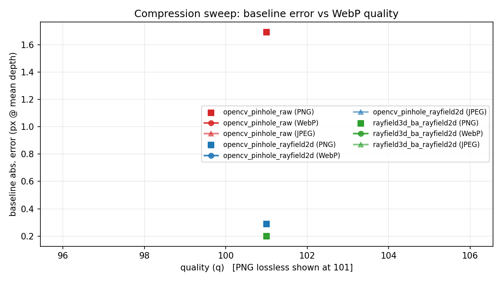
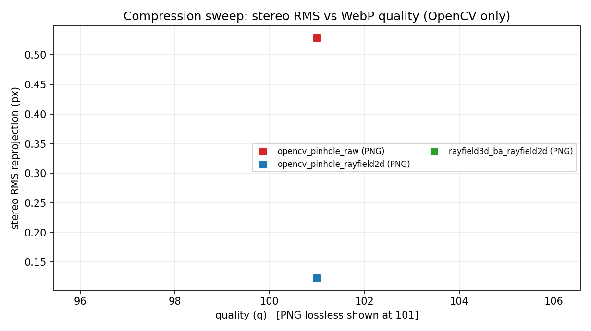
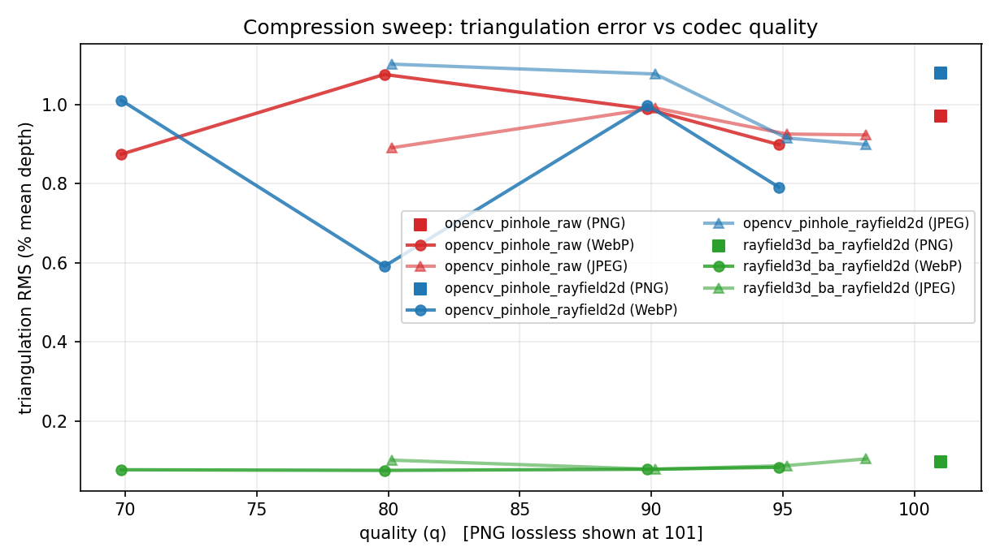

# Image compression and 3D reconstruction

This page studies how image compression impacts:

1. **ChArUco-based OpenCV stereo calibration**, and
2. the **ray-based 3D reconstruction** pipeline (*central 3D ray-field + point↔ray bundle adjustment*).

The main goal is practical: determine whether a ray-based reconstruction remains usable when images are **strongly compressed** (for storage, telemetry, or embedded/robotics pipelines).

## Experimental design

We reuse the exact same scene stored with different codecs/qualities via `stereocomplex sweep-compression`.

We compare three pipelines:

1. **OpenCV pinhole (raw)**: calibrate from raw OpenCV ChArUco detections.
2. **OpenCV pinhole (+ 2D ray-field)**: refine corners with `rayfield_tps_robust`, then calibrate with OpenCV.
3. **3D ray-field (+ 2D ray-field)**: refine corners with `rayfield_tps_robust`, then calibrate a central 3D ray-field via point↔ray bundle adjustment (nonlinear least squares) and triangulate.

### Metrics

- **Stereo baseline error in pixels**: reported as `baseline_abs_error_px_at_mean_depth`.
  This is a disparity-equivalent measure and is the most interpretable unit for stereo matching quality.
- **Stereo RMS reprojection error (px)**: OpenCV-only metric (low is better).
- **Triangulation RMS (% mean depth)**:
  - For OpenCV pinhole: direct RMS error vs GT (absolute scale is defined).
  - For 3D ray-field: we report a **similarity-aligned** 3D error, because the ray-based model has a weak gauge (global similarity drift) in this prototype.

## Codec quality sweep (WebP + JPEG)

Command (uses cached intermediate JSON files; does not regenerate datasets):

```bash
.venv/bin/python paper/experiments/sweep_compression_3d_methods.py \
  --root dataset/compression_sweep \
  --png png_lossless \
  --webp webp_q70,webp_q80,webp_q90,webp_q95 \
  --jpeg jpeg_q80,jpeg_q90,jpeg_q95,jpeg_q98 \
  --split train --scene scene_0000 \
  --out paper/tables/compression_compare/sweep_webp_quality.json \
  --plots-out docs/assets/compression_sweep
```

### Baseline error (px @ mean depth)

This figure is the key robotics/stereo-DIC indicator: it directly relates to vertical/horizontal consistency after rectification and to the stability of epipolar geometry.



### Stereo RMS reprojection (OpenCV)

This is the OpenCV objective. It can decrease even when some physical parameters drift, because the optimizer can trade off intrinsics/distortion/pose to reduce pixel residuals.



### Triangulation error (RMS, % mean depth)

This plot illustrates 3D robustness under compression. For the ray-field pipeline, the error is reported after similarity alignment (see Metrics).



The exact numeric results used to generate these plots are saved as:

- `docs/assets/compression_sweep/sweep_metrics.json`

The plotting script automatically includes **all computed codec qualities** found in the sweep results (e.g. `webp_q*`, `jpeg_q*`), so extending the sweep does not require manual plot edits.

## Key finding: 3D ray-field is remarkably stable under compression

On this sweep, the **central 3D ray-field + bundle adjustment** pipeline is both:

- **stable** across strong lossy compression, and
- **consistently better in 3D** than OpenCV pinhole, even when pinhole uses 2D ray-field refined corners.

Quantitatively (range over the tested qualities):

- **3D ray-field (+2D ray-field)**:
  - WebP q70–q95: baseline error stays in `[0.166, 0.247] px@Z̄` and triangulation stays in `[0.075, 0.083] %Z̄` (similarity-aligned).
  - JPEG q80–q98: baseline error stays in `[0.195, 0.296] px@Z̄` and triangulation stays in `[0.078, 0.104] %Z̄` (similarity-aligned).
- **OpenCV pinhole (+2D ray-field)** is still sensitive:
  - WebP q70–q95: baseline error spans `[0.042, 0.308] px@Z̄` and triangulation spans `[0.591, 1.010] %Z̄`.
  - JPEG q80–q98: baseline error spans `[0.062, 0.384] px@Z̄` and triangulation spans `[0.899, 1.102] %Z̄`.

The baseline error for the pinhole pipeline can occasionally be *very* low at a specific quality, but it is not monotonic and not stable. In contrast, the ray-based pipeline yields a tight band of performance across codecs and qualities, which is exactly what is needed for compressed, real-time robotics/stereo pipelines.

## Discussion: why can compression sometimes “help” OpenCV, yet remain unstable?

It is not intuitive, but it is plausible to observe that **moderate lossy compression can improve some metrics** in a ChArUco-based pipeline, for at least three reasons:

1. **Implicit low-pass filtering**: codecs often suppress high-frequency components. When the limiting factor is corner localization jitter caused by aliasing/noise/over-sharpened edges, mild smoothing can reduce bias and outliers.
2. **Detection non-linearities and selection effects**: the set of detected markers/corners can change across codecs (some frames may fail, some points may be rejected). This changes the calibration problem itself and can shift the solution (sometimes for the better, sometimes for the worse).
3. **Model mismatch compensation**: OpenCV calibration may reach a different local optimum depending on the outlier pattern. A change in compression can change the outlier pattern, which can make the pose/baseline estimation appear “better” even if the image is objectively worse.

This explains the “surprising” observation that raw pinhole metrics can sometimes improve at a given lossy quality (e.g. by implicit low-pass filtering), while remaining inconsistent across the sweep.

### Why the 3D ray-field stays stable

The ray-field pipeline reduces compression sensitivity at two levels:

1. **2D ray-field refinement** enforces a smooth board→image mapping, reducing corner jitter and down-weighting outliers.
2. **Ray-based 3D calibration** avoids forcing a single global pinhole/distortion model to explain all residuals. The point↔ray bundle adjustment aggregates constraints across multiple poses and tends to produce a more stable stereo geometry (baseline/epipolar consistency) under measurement perturbations.
