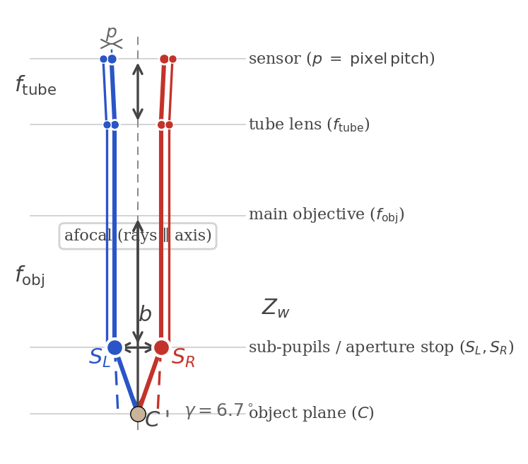

# Real CMO microscope calibration on Pycaso data

## Calibrating a non-central microscope when OpenCV fails

> **First real-data validation of the StereoComplex non-central pipeline.**
> This page is the stable, readable reference.  The executable protocol is
> [Notebook 09](../examples/notebooks/09_pycaso_real_data.py).

## Why this page exists

Standard cameras have **one optical centre**: all chief rays pass through
a single point.  OpenCV's stereo calibration (`cv2.stereoCalibrate`)
assumes this pinhole model.  Most stereo microscopes **do not** work this
way.

A Common Main Objective (CMO) stereo microscope uses a single large
objective shared between two off-axis sub-apertures.  The two channels'
chief rays appear to originate from **two different points** — the
effective sub-pupils — separated by the stereo baseline.  OpenCV's
central projection model cannot represent this architecture and produces
unusable results (> 300 px reprojection error under the tested
configuration).



**StereoComplex solves this by measuring first and modelling second.**
Instead of imposing a camera model upfront, we measure a per-pixel
rayfield $\mathcal{R}(u,v) = (O(u,v), d(u,v))$ — a 3‑D line for every
pixel — using a flexible Zernike polynomial basis.  From this *measured*
rayfield we read physical descriptors, diagnose structural mismatches,
and iteratively build a compact physical model that captures the
dominant CMO geometry.

## Executive summary

| What we did | What we found |
|---|---|
| Calibrated a real CMO microscope with legacy ChArUco images | OpenCV fails (> 300 px); Zernike rayfield succeeds (0.47 px) |
| Read physical descriptors directly from the measured rays | $b = 24.9$ mm, $WD = 64.7$ mm, $f_{\text{obj}} = 62.2$ mm, $\theta = 22.6°$ |
| Diagnosed telecentricity from the $d_y(u,v)$ field | 3× range difference vs perspective model → built telecentric CMO |
| Used residual modal analysis to identify missing physics | $\Delta d$ and $\Delta m$ are 97–98 % $Z_0^0$ → global arm misalignment |
| Added per-channel SE(3) arm alignment | **1.06 px** reprojection (P50 = 0.87 px, P95 = 1.84 px) — 14× better |
| Formal BIC model selection | Telecentric CMO wins by > 40 000 BIC points over all alternatives |

## Claims and evidence

| Claim | Evidence | Status |
|---|---|---|
| Pycaso dataset can be processed as legacy ChArUco | Detection with `DICT_6X6_250` + `setLegacyPattern(True)` | Supported |
| Hessian completion fills all 165 corners | $\|\det H\|$ + Otsu + barycentre | Supported |
| Double TPS eliminates the pose/rayfield gauge | Z₀ drift drops from 8.5° to 0.023° | **Key result** |
| Zernike rayfield reaches subpixel calibration | 0.47 px local pixel-equivalent RMS | Supported |
| Physical descriptors are read directly from $(O, d)$ | $b, WD, f_{\text{obj}}, \theta$ without model fit | Diagnostic |
| $d_y(u,v)$ reveals telecentricity | 3× range difference vs perspective | Diagnostic |
| Residual modal analysis identifies missing DOF | $\Delta d$ and $\Delta m$ are 97–98 % $Z_0^0$ (global, not spatial) | **Diagnostic method** |
| SE(3) arm alignment resolves the global residual | 14.6 → 1.06 px (14× improvement) | **Key result** |
| BIC model selection confirms CMO architecture | Telecentric CMO wins by > 40 000 BIC points | **Key result** |
| The rayfield is a general diagnostic instrument | Observe → diagnose → fix → verify loop | **General strategy** |

## What this case study does **not** evaluate

- It does **not** validate absolute metrological accuracy on an independent 3‑D object.
- It does **not** estimate a full uncertainty budget.
- It does **not** prove that the SE(3) arm transforms correspond to specific
  physical misalignments (they are an effective parameterisation).
- It does **not** test generalisation to other microscopes or datasets.

## The dataset

| Property | Value |
|---|---|
| Sensor | 2048 × 2048 px |
| Board | Legacy ChArUco, 16 × 12 squares, 0.3 mm |
| Dictionary | DICT_6X6_250, `setLegacyPattern(True)` |
| Frames | 10 stereo pairs |
| Z range | 2.65 – 3.35 mm (Δ = 0.70 mm) |

The 10 frames span a narrow depth range (0.70 mm) typical of
high-magnification microscopy.  With 165 corners per frame, we have
3300 ray observations (165 × 10 × 2 channels) — well-conditioned for
the 57-parameter Zernike fit.  Ten frames is sufficient for this
dataset; the calibration remains stable with as few as 6 frames.

The dataset is **not vendored** in the StereoComplex repository.  Clone
[Pycaso](https://github.com/LaboratoireMecaniqueLille/Pycaso) at
`examples/pycaso_data`.

## Pipeline

```text
ChArUco legacy detection (DICT_6X6_250, setLegacyPattern)
       ↓
Hessian corner completion (|det H| + Otsu + barycentre)  →  165/165 corners
       ↓
Ray2D TPS denoising on ArUco markers → predict 165 ChArUco
       ↓
TPS re-denoising on completed 165 corners (λ=3, Huber c=1.5)
       ↓
Constrained Zernike rayfield O(0)+d(2), shared R+XY, per-pose Z
       ↓
Stability test: ΔZ₀ < 0.1° between constrained and full-pose fits
       ↓
Read CMO descriptors from (O, d)
       ↓
Propose physical models → fit → residual analysis → iterate
```

Ray2D TPS is a **purely 2‑D regularisation step**.  It does not assume
any 3‑D camera model — it predicts where occluded corners likely are
based on their neighbours, using a homography + thin-plate spline
residual field.  This step does not bias the 3‑D model selection that
follows.

### The double TPS pass

The second TPS pass is critical for rayfield stability:

1. TPS on ArUco marker corners predicts all 165 ChArUco grid corners.
2. A second TPS pass uses the completed 165 corners themselves as control
   points with tighter smoothing (λ = 3, Huber c = 1.5).

Before double TPS, the constrained and full-pose Zernike fits produce
dramatically different rayfields (Z₀ drift = 8.5°, baseline 17 ↔ 28 mm).
After double TPS, the gauge ambiguity vanishes (Z₀ drift = 0.023°).
The Zernike rayfield becomes a **stable experimental oracle**.

The double TPS is a denoising regularizer whose validity is confirmed
not by the 2‑D residual alone, but by the disappearance of gauge drift
in the 3‑D Zernike fit.

### Error metric

> **The reported residual is not an OpenCV reprojection RMS.**

For each observed pixel, the fitted ray is intersected with the estimated
board plane.  The 3‑D distance to the corresponding board point is
converted to a **local pixel-equivalent residual**:

$$e_{\text{px}} \approx \frac{e_{\text{mm}}}{|t|} f_x.$$

This is a local first-order approximation, not an image-plane reprojection
residual from a projective camera model.

## Step-by-step: from rayfield to physical model

### Step 1 — The Zernike rayfield as observable

The Zernike rayfield $\mathcal{R}(u,v) = (O(u,v), d(u,v))$ maps each
pixel to a 3‑D line.  We fit O(0) + d(2): rigid sub-pupil per channel
(origin order 0), spatially-varying direction correction (direction
order 2), with constrained poses (shared rotation + XY, per-pose Z).
This gives 57 parameters total.  The fit reaches **0.47 px** local
pixel-equivalent RMS.

From the centre-pixel ray $(O, d)$ we **read physical descriptors
directly** — no model fit required:

| Descriptor | Symbol | How to read it | Value |
|---|---|---|---|
| Stereo baseline | $b$ | $\|O_R - O_L\|$ | **24.9 mm** |
| Sub-pupil depth | $z_p$ | $(|O_{L,z}| + |O_{R,z}|)/2$ | **2.5 mm** |
| Working distance | $WD$ | Mean of pose Z estimates | **64.7 mm** |
| Objective focal length | $f_{\text{obj}}$ | $WD - z_p$ | **62.2 mm** |
| Convergence angle | $\theta$ | $\arccos(d_L \cdot d_R)$ | **22.6°** |

These are coordinates in millimetres, expressed in the camera frame:
the left sub-pupil sits 12.7 mm to the left of the optical centre,
0.1 mm above, and 2.7 mm forward of the principal plane.  The baseline
$b = \|O_R - O_L\| = 24.9$ mm is a physical length you could verify
at the microscope mount.

These are **not fitted physical CMO parameters** — they are rayfield
readouts under a constrained Zernike gauge.

### Step 2 — Perspective CMO: the baseline hypothesis

The simplest CMO model assumes each channel is a perspective camera
viewing the object through a decentered sub-pupil.  Rays originate from
$S_c = (\pm b/2,\; 0,\; WD - f_{\text{obj}})$ and fan out to the sensor,
predicting $d_y(u,v) \propto (v - c_y)$.

**What we observe.**  The Zernike $d_y$ field is **nearly constant**
across the field (range = 0.079, mean = +0.059), while the perspective
CMO predicts a gradient from −0.116 to +0.116 (range = 0.232) — a
**3× range difference**.

**Diagnosis.**  The near-constant $d_y$ is the signature of **object-space
telecentricity**: the chief rays are almost parallel, not diverging from
a point.  No adjustment of principal point, distortion, or pitch can
fix a 3× structural mismatch — we need a different model family.

### Step 3 — Telecentric CMO: matching the observed structure

The rayfield tells us what the model should look like:

- **Origins** are well described by rigid sub-pupils.
- **Directions** are nearly constant, with weak affine variations — no
  perspective gradient.

This leads to `CMOTelecentricStereoModel`:

$$O_c = S_c = (\pm b/2,\; 0,\; WD - f_{\text{obj}})$$

$$d_c(u,v) = \operatorname{normalize}\left(d_{c,0} + s_x \tilde{u}\,
e_x + s_y \tilde{v}\, e_y + \text{cross} + \text{quadratic}\right)$$

The key difference: **the direction is not derived from a point
projection.**  Instead, $d(u,v)$ is directly parameterised as an affine
function of pixel position.  Adding pupil shear ($\rho_x, \rho_y$) —
an affine variation of the origin transverse to the direction — gives
the **14-parameter** variant.

**Result:**

| Metric | Perspective CMO | Telecentric + shear |
|---|---|---|
| Ray RMS (two-plane) | 3.48 mm | **0.12 mm** (29× better) |
| Pixel RMS | 86 px | **14.6 px** (5.9× better) |
| Parameters | 19 | 14 |

The 14-parameter telecentric model captures the dominant geometry with
fewer parameters and far better fidelity — because the model family
matches the observed structure.

### Step 4 — Residual analysis: what is the model still missing?

The telecentric model reaches 0.12 mm ray RMS but plateaus at ~14.6 px
reprojection.  We compute the residual against the Zernike oracle:

- **Direction residual:** $\Delta d = d_{\text{Zernike}} - d_{\text{CMO}}$
- **Moment residual:** $\Delta m = m_{\text{Zernike}} - m_{\text{CMO}}$,
  where $m = O \times d$ (the Plücker moment).

Projecting on Zernike modes up to order 4:

| Mode | Δd (L) | Δd (R) | Δm (L) | Δm (R) | Interpretation |
|---|---:|---:|---:|---:|---|
| $Z_0^0$ (piston) | **97 %** | **96 %** | **98 %** | **98 %** | **Global offset** |
| $Z_1^1$ (tilt) | 2 % | 3 % | 2 % | 2 % | Negligible |
| All $n \ge 2$ | < 0.5 % | < 1 % | < 0.1 % | < 0.1 % | Negligible |

**Both Δd and Δm are dominated by $Z_0^0$ — a constant mode.**  A
$Z_0$-dominated residual is a **global line-bundle offset**, not a
spatial field distortion.  The two optical arms each have a small rigid
misalignment relative to the ideal CMO skeleton.

### Step 5 — Testing alternative hypotheses

Before committing to arm alignment, we test two alternatives:

**Hypothesis A — Image-space pre-warp.**  Add a polynomial
$\xi = W(u,v)$ before the direction model.

| Model | Params | Ray RMS | Pixel RMS |
|---|---|---|---|
| Telecentric L0 | 14 | 0.118 mm | 14.6 px |
| + affine warp | 20 | 0.115 mm | **16.0 px** (worse) |
| + quadratic warp | 26 | 0.115 mm | **16.5 px** (worse) |

The pre-warp degrades pixel RMS — consistent with the $Z_0$ diagnostic
(a warp would produce spatial, not global, changes).

**Hypothesis B — Spatially varying origin.**  Fit affine and quadratic
transverse origin fields with direction fixed.

| Origin model | Ray RMS | vs constant |
|---|---|---|
| O0 (constant) | 0.117 mm | baseline |
| O1 (affine) | 0.107 mm | 8 % reduction |
| O2 (quadratic) | 0.107 mm | no further gain |

Only 8 % improvement — the residual is not spatial.

### Step 6 — SE(3) arm alignment: the breakthrough

The $Z_0$-dominated residual points to a **global** misalignment.  We
add a per-channel rigid transform to the telecentric model's Plücker
lines:

$$d' = R_c \, d_{\text{tel}}, \qquad O' = R_c \, O_{\text{tel}} + t_c$$

where $(R_c, t_c)$ is a small rotation and translation for each channel
(12 additional parameters, 26 total).

Fitting jointly against the Zernike rayfield:

| Metric | Telecentric L0 | **Telecentric + SE(3)** | Zernike ref |
|---|---|---|---|
| Parameters | 14 | **26** | 57 |
| Ray RMS (mm) | 0.118 | **0.0021** | 0.0007 |
| Direction RMS (°) | 0.27 | **0.003** | 0 |
| Moment RMS (mm) | 0.32 | **0.001** | 0 |
| **Pixel RMS (px)** | 14.6 | **1.06** | 0.47 |
| **Pixel P50 (px)** | 13.2 | **0.87** | — |

> **Important caveat on the Zernike comparison.**  The Zernike two-plane
> RMS of 0.0007 mm is a **training residual** — it measures how well the
> Zernike model represents itself on the support points it was fitted to.
> The Telecentric models are evaluated **against the Zernike rayfield**
> as ground-truth proxy, so their RMS reflects both the structural mismatch
> and any noise that the Zernike absorbed.  The pixel RMS column gives
> a more apples-to-apples view: both models are evaluated on the same
> corner observations.  The 26p Telecentric + SE(3) achieves 1.06 px
> with half the parameters of the 57p Zernike (0.47 px).

The SE(3) arm alignment reduces pixel RMS by **14×** (14.6 → 1.06 px).
Rotations are stable across runs (~2.5° left, ~3.7° right); translations
are sub-mm but trade off with telecentric base parameters.

### Step 6b — Ablation: which SE(3) parameters are essential?

| Variant | Params | Ray RMS | Px RMS | P50 | P95 |
|---|---|---|---|---|---|
| Telecentric (baseline) | 14 | 0.048 mm | 14.6 px | 13.2 px | 22.4 px |
| + Rotation only L/R | 20 | 0.014 mm | 3.74 px | 2.68 px | 7.13 px |
| + Translation only L/R | 20 | 0.010 mm | 2.44 px | 2.06 px | 4.15 px |
| **+ Full SE(3) L/R** | **26** | **0.0021 mm** | **1.06 px** | **0.87 px** | **1.84 px** |
| + Shared rotation | 23 | 0.0083 mm | — | — | — |
| + Shared translation | 23 | 0.0041 mm | — | — | — |
| + Differential only | 20 | 0.0070 mm | 4.04 px | 2.85 px | 7.74 px |

**Both rotation and translation are essential.  Per-arm DOFs are
individually necessary — 26 parameters is the true minimum.**

### Step 7 — Autopsy of the 26p model and BIC model selection

The 26p model achieves 1.06 px with excellent L/R symmetry (1.10 vs
1.01 px).  Residual direction RMS is 0.003°, moment RMS is 0.0006 mm —
the SE(3) has eliminated the Z₀ piston.

**Formal BIC model selection** on the Pycaso Zernike rayfield:

| Model | P | RMS (mm) | BIC | Selected? |
|---|---|---|---|---|
| **cmo_telecentric_shear** | **14** | **0.111** | **−36 129** | ★ BIC best |
| cmo_telecentric | 12 | 0.146 | −33 201 | |
| pinhole_parallel_plate | 6 | 6.338 | +5 079 | |
| central_pinhole | 0 | 8.343 | +6 500 | |
| central_brown_conrady | 10 | 8.324 | +6 549 | |

The telecentric CMO wins by **> 40 000 BIC points** over all alternative
physical models — a decisive confirmation that the CMO architecture is
the correct model family for this dataset.  The shear variant (14 params)
is preferred over no-shear (12 params), confirming that pupil shear
captures meaningful structure (ΔBIC ≈ 2 900).

**What remains after 26p.**  The residual is distributed across Zernike
orders 1–3 with no single dominant block.  PCA on the two-plane residual
reveals effective rank ≈ 4 (96 % variance in 2 modes), but the modes
are **spatially varying** — no global correction helps.  A rank‑2
per-pixel correction would theoretically reach ~0.22 px, but requires
spatial parameterisation (i.e., Zernike flexibility).

**Final model hierarchy:**

| Model | Params | Pixel RMS | P50 | Nature |
|---|---|---|---|---|
| Perspective CMO | 19 | ~86 px | — | Baseline (inadequate) |
| Telecentric L0 | 14 | ~14.6 px | 13.2 px | Correct family, missing DOF |
| **CMO + SE(3)** | **26** | **1.06 px** | **0.87 px** | **Compact physical model** |
| Zernike O(0)+d(2) | 57 | 0.47 px | — | Flexible subpixel reference |

### Step 8 — Why the residual analysis was decisive

```text
Residual Δd, Δm projected on Zernike modes
       │
       ├── Z0-dominated (97-98%) → GLOBAL misalignment
       │       │
       │       ├── Pre-warp image? → NO (degrades)
       │       ├── Variable origin? → NO (8% gain)
       │       └── SE(3) arm alignment? → YES (14× improvement)
       │
       └── Higher modes dominant → SPATIAL distortion
               └── (Not what we observe)
```

Without the rayfield, we would be guessing.  The 2‑D reprojection error
tells you *that* the model is wrong, but not *how*.  The Zernike
projection of Δd and Δm tells you exactly what kind of degree of freedom
is missing.

## The Ray2D → Ray3D feedback loop

The double TPS pass was essential: before it, the Zernike rayfield was
gauge-unstable (Z₀ drift = 8.5°).  After it, the gauge ambiguity
vanishes (Z₀ drift = 0.023°) and the Zernike rayfield becomes a **stable
experimental oracle**.

This feedback loop — Ray2D → Ray3D → diagnose → fix Ray2D → verify with
Ray3D — is a **general strategy** for any stereo calibration pipeline:

```text
┌──────────────────────────────────────────────────────────────┐
│  Ray2D: corner detection + completion + TPS denoising        │
│                         ↓                                    │
│  Ray3D: Zernike rayfield — the experimental oracle           │
│                         ↓                                    │
│  Read descriptors from (O, d) — baseline, WD, f_obj, θ      │
│                         ↓                                    │
│  Propose physical model → residual vs Zernike                │
│                         ↓                                    │
│  Residual is Z0 (global)? → missing global DOF               │
│  Residual is spatial?     → missing field structure          │
│                         ↓                                    │
│  Add DOF → refit → evaluate → iterate                        │
│                         ↓                                    │
│  Final model: 1.06 px reprojection (P50 = 0.87 px)          │
└──────────────────────────────────────────────────────────────┘
```

**Why this is not possible with standard calibration.**  The 2‑D
reprojection error is **blind** to the pose/rayfield gauge — a full-pose
fit can absorb corner noise into rayfield distortions without increasing
pixel RMS.  You can have "good" 2‑D residuals and a physically unstable
rayfield at the same time.  Only the rayfield reveals the problem, and
only the rayfield tells you *which* degree of freedom is missing.

**This is a general strategy, not specific to CMO microscopes.**  Any
stereo calibration pipeline that fits a pixel-to-ray mapping can use the
same test: fit with constrained poses, fit with free poses, compare the
rayfields.  If they differ substantially, your corners are not clean
enough for physically interpretable calibration.

## Limitations

1. **Gauge dependence.**  The Zernike origin $O(u,v)$ is defined up to a
   displacement along the ray direction.  The transverse gauge
   $O(u,v) \cdot d(u,v) = 0$ is enforced.

2. **Constrained poses.**  The shared-rotation + per-pose-Z assumption is
   physically motivated but unverified.

3. **Fixed K.**  The Zernike BA uses a fixed pinhole reference
   ($f_x = 25600$, principal point at image centre).

4. **No independent 3‑D ground truth.**  Residuals are computed on the
   same board points used for calibration.

5. **Single dataset.**  These results are for one specific Pycaso
   microscope and one calibration target.

6. **SE(3) translation parameters are not uniquely identifiable.**  The
   rotation angles (~2.5°, ~3.7°) are stable across optimisation runs,
   but the translation components vary — they trade off with the
   telecentric base parameters (WD, $f_{\text{obj}}$, $b$, principal
   point).  The SE(3) rotation is the robust diagnostic.

7. **The BIC comparison evaluates models in ray space, not pixel space.**
   The two-plane residual metric amplifies angular errors by $\Delta Z$,
   which may penalise models differently than direct corner reprojection.

## Saved artefacts

```text
docs/assets/pycaso_real_data/
    detection_summary.json                 ← per-frame ChArUco counts
    summary.json                           ← calibration RMS, CMO descriptors
    model_comparison.json                  ← Zernike vs telecentric vs perspective
    zernike_pose_variants.json             ← full Zernike coeffs for both pose models
    zernike_conditioning_diagnostic.json   ← design matrix, modal Δd, sensitivity
    zernike_gauge_regularization_sweep.json ← regularization sweep
    moment_residual_diagnostic.json        ← Δm modal decomposition + O1/O2 fits
    arm_alignment_diagnostic.json          ← SE(3) arm alignment sweep
    aligned_cmo_fit.json                   ← final joint fit (telecentric + SE(3))
    se3_ablation.json                      ← SE(3) parameter ablation study
    autopsy_20p.json                       ← 20p model autopsy (negative control)
    autopsy_26p.json                       ← 26p model autopsy + compression
    pca_residual_26p.json                  ← PCA low-rank residual analysis
    warped_model_comparison.json           ← pre-warp L1/L2 evaluation
    bic_model_selection.json               ← BIC model selection on Pycaso data
    pareto_gauge_regularization.png        ← Pareto frontier plot
```

To regenerate:

```bash
PYTHONPATH=src python examples/notebooks/09_pycaso_real_data.py
```

## See also

- :doc:`IDENTIFY_MY_OPTICS` — how to read physical descriptors from a rayfield
- :doc:`CMO_PHYSICAL_MODEL` — the shared-rig CMO model definition
- :doc:`DIRECT_VS_RAYFIELD_INVERSION` — why measure a rayfield before fitting optics
- :doc:`NOTEBOOKS` — all walkthrough notebooks
- [Notebook 09](../examples/notebooks/09_pycaso_real_data.py) — executable protocol
