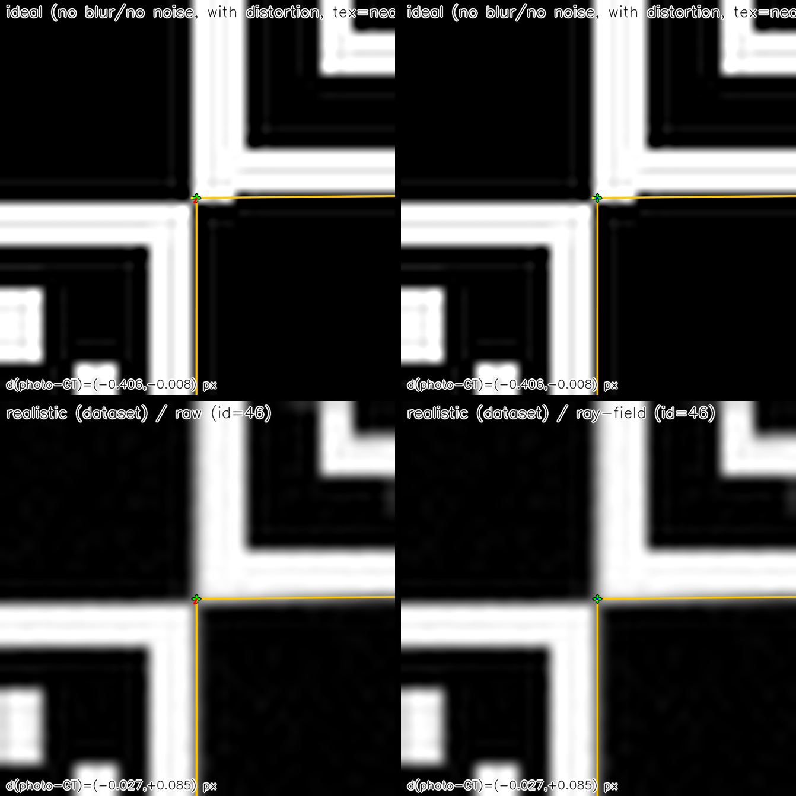

StereoComplex
=============

Fix OpenCV calibration plateaus, and reconstruct 3D without a pinhole model
-------------------------------------------------------------------------------

StereoComplex is a practical toolkit to **refine ChArUco corners before calibration** using a geometric prior on the board plane
(`rayfield_tps_robust`: homography + smooth residual field + robust fitting).

This simple “2D cleanup” step is often enough to make classic OpenCV calibration **much more stable** on challenging data.

Motivation: in many practical stereo systems, calibration accuracy is limited by **2D localization quality** (blur, compression, noise) rather than by the camera model itself.

Terminology note: here, “ray-field” can refer to either (1) a **2D planar warp** learned on the board plane (homography + smooth residual field) or (2) an experimental **3D ray-based model**. The 2D method is not a per-pixel 3D ray model.

Engineering footprint: no ROS, no Docker requirement, no C++ toolchain; the core is a Python package using standard scientific libraries.

   Same GT (with geometric distortion) on a strict ideal render (top: no blur/no noise, nearest texture sampling) vs realistic (bottom), raw vs ray-field.

.. rubric:: Key result: 3D ray-field robustness to compression

StereoComplex includes an experimental **3D ray-based stereo reconstruction** prototype. On the provided compression sweep, the **3D ray-field** remains stable under lossy compression, while pinhole-based pipelines remain sensitive to codec artifacts through the 2D localization stage.

.. figure:: assets/compression_sweep/tri_rms_rel_depth_percent.png
   :alt: Compression sweep: triangulation RMS vs codec quality (pinhole vs 3D ray-field)
   :width: 92%

   Compression sweep: triangulation RMS (relative depth error) vs codec quality, comparing pinhole-based pipelines to the 3D ray-field.

.. rubric:: Quickstart (what most users want)

1) Refine corners (exports JSON + an OpenCV-ready NPZ):

.. code-block:: bash

   .venv/bin/python -m stereocomplex.cli refine-corners dataset/v0_png \
     --split train --scene scene_0000 \
     --method rayfield_tps_robust \
     --out-json paper/tables/refined_corners_scene0000.json \
     --out-npz paper/tables/refined_corners_scene0000_opencv.npz

2) Run the reproducible OpenCV evaluation (raw vs ray-field) on the same scene:

.. code-block:: bash

   .venv/bin/python paper/experiments/compare_opencv_calibration_rayfield.py dataset/v0_png \
     --split train --scene scene_0000 \
     --out paper/tables/opencv_calibration_rayfield.json

.. rubric:: Also: 3D reconstruction without a pinhole model (prototype)

StereoComplex also includes a **ray-based stereo reconstruction** prototype: it calibrates a compact mapping
pixel → ray direction (Zernike basis) using a point↔ray bundle adjustment over multiple planar poses
(**no solvePnP, no known** ``K``), then triangulates from the two rays.

.. code-block:: bash

   .venv/bin/python paper/experiments/calibrate_central_rayfield3d_from_images.py dataset/v0_png \
     --split train --scene scene_0000 --max-frames 5 \
     --method2d rayfield_tps_robust \
     --nmax 10 --lam-coeff 1e-3 --outer-iters 3 \
     --out paper/tables/rayfield3d_ba_scene0000.json \
     --export-model models/scene0000_rayfield3d

.. rubric:: Documentation map

- I want a practical guide: :doc:`FIX_MY_CALIBRATION`
- I want alternatives and scope/positioning: :doc:`ALTERNATIVES_POSITIONING`
- I want the full worked example (plots + overlays): :doc:`RAYFIELD_WORKED_EXAMPLE`
- I want stereo/3D metrics and baseline-in-pixels: :doc:`STEREO_RECONSTRUCTION`
- I want multi-case robustness results: :doc:`ROBUSTNESS_SWEEP`
- I want to load/export models and reconstruct via an API: :doc:`RECONSTRUCTION_API`
- I want the public API contract: :doc:`PUBLIC_API`
- I want compression robustness for 3D reconstruction: :doc:`COMPRESSION_RECONSTRUCTION`
- I want the math and ray-based calibration: :doc:`RAYFIELD3D_RECONSTRUCTION`
- Licensing: :doc:`LICENSE`

.. toctree::
   :maxdepth: 2
   :caption: Getting started
   :hidden:

   START_HERE
   FIX_MY_CALIBRATION
   ALTERNATIVES_POSITIONING
   LICENSE
   ARCHITECTURE
   DATASET_SPEC
   CONVENTIONS

.. toctree::
   :maxdepth: 2
   :caption: ChArUco / Ray-field
   :hidden:

   CHARUCO_IDENTIFICATION
   RAYFIELD_WORKED_EXAMPLE

.. toctree::
   :maxdepth: 2
   :caption: Calibration / 3D
   :hidden:

   STEREO_RECONSTRUCTION
   ROBUSTNESS_SWEEP
   COMPRESSION_RECONSTRUCTION
   RECONSTRUCTION_API
   PUBLIC_API
   RAYFIELD3D_RECONSTRUCTION
