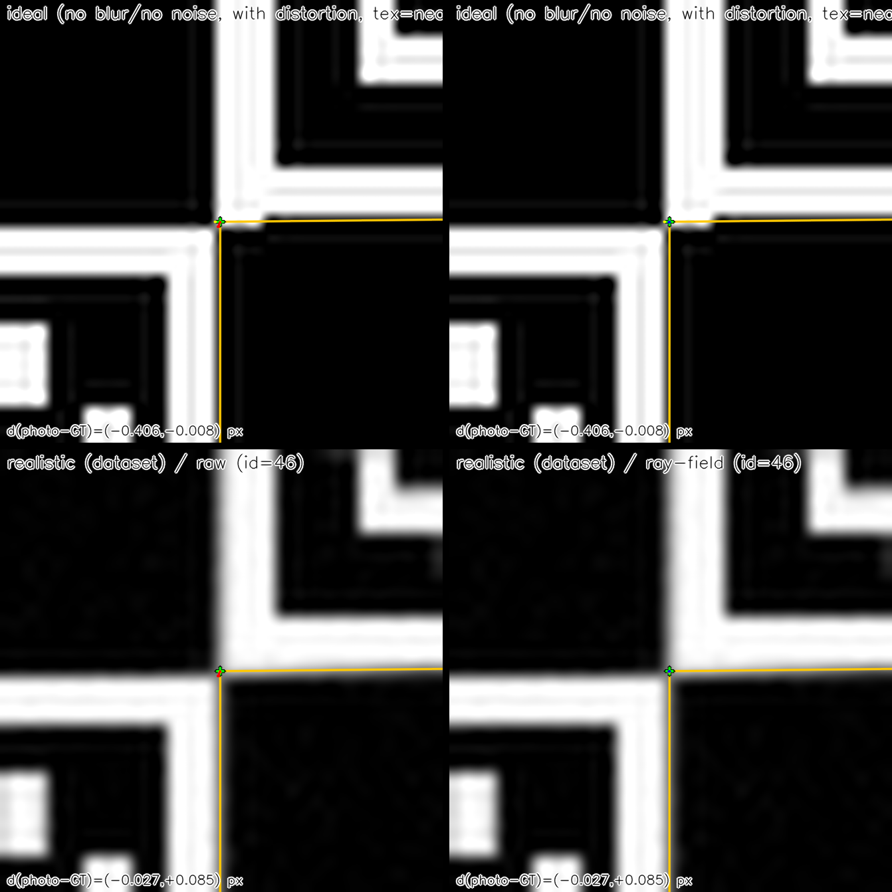
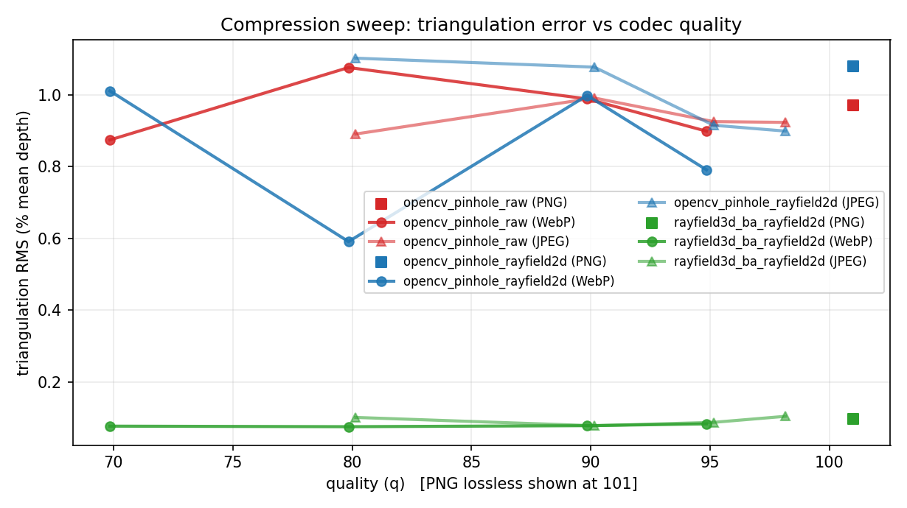

StereoComplex
=============

Robust ChArUco calibration and ray-based stereo reconstruction
----------------------------------------------------------------

From robust ChArUco observations to central and non-central ray-based stereo calibration.

StereoComplex is a lightweight Python toolkit for robust stereo calibration and ray-based 3D reconstruction.
It starts from practical ChArUco workflows: detect corners, run a robust Ray2D planar refinement,
compare raw OpenCV against refined observations, and export OpenCV-ready data.

It also includes experimental 3D ray-based calibration backends: a central ray-field stereo model and
a non-central Zernike origin-field model where each pixel maps to a 3D line rather than to a ray emitted
from a fixed pinhole center.

.. rubric:: Video 1 (overview)

.. raw:: html

   <iframe width="560" height="315"
     src="https://www.youtube.com/embed/8Mbcv5l7ek0"
     title="StereoComplex overview"
     frameborder="0"
     referrerpolicy="strict-origin-when-cross-origin"
     allow="accelerometer; autoplay; clipboard-write; encrypted-media; gyroscope; picture-in-picture"
     allowfullscreen></iframe>

Motivation: in many practical stereo systems, calibration accuracy is limited by **2D localization quality** (blur, compression, noise), and in some optical systems the pinhole/central-camera assumption itself is too restrictive.

.. rubric:: Key contributions

1. **Robust ChArUco refinement without requiring a camera model.** Ray2D / ``rayfield_tps_robust`` uses a homography plus a smooth residual field on the board plane.
2. **OpenCV-compatible stereo calibration diagnostics.** StereoComplex compares raw and refined ChArUco points and reports stereo/reconstruction metrics.
3. **Central 3D ray-field reconstruction.** The central backend learns a compact pixel-to-ray direction model and triangulates from rays.
4. **Experimental non-central stereo calibration.** The non-central backend fits a Zernike origin field ``O(u,v)``, so each pixel defines a 3D line instead of sharing one optical center.
5. **Synthetic non-central oracle benchmark.** An inclined parallel-plate model generates physically plausible non-central stereo data without fitting plate parameters.
6. **Practical non-central image workflow.** A public experimental API fits a Zernike origin-field model directly from two image folders.
7. **Ray-space optical model selection.** A measured Zernike rayfield can be used to compare compact physical hypotheses such as central Brown-Conrady, inclined plate, and CMO polynomial-channel models.

.. rubric:: Ray-field terminology

.. list-table::
   :header-rows: 1

   * - Term
     - Meaning
     - Dimension
     - Status
   * - Ray2D / planar ray-field
     - Homography + smooth residual field on the calibration board plane
     - 2D
     - stable practical preprocessing
   * - Central 3D ray-field
     - Pixel → 3D direction, shared camera center
     - 3D central
     - experimental
   * - Non-central 3D rayfield
     - Pixel → 3D line ``(O(u,v), d(u,v))``
     - 3D non-central
     - experimental

The 2D Ray2D refinement is not itself a 3D non-central camera model. It improves the image observations fed to calibration. The non-central backend is a separate 3D line-based model.

Engineering footprint: no ROS, no Docker requirement, no C++ toolchain; the core is a Python package using standard scientific libraries.

   Same GT (with geometric distortion) on a strict ideal render (top: no blur/no noise, nearest texture sampling) vs realistic (bottom), raw vs ray-field.

.. rubric:: Key result: 3D ray-field robustness to compression

StereoComplex includes an experimental **3D ray-based stereo reconstruction** prototype. On the provided compression sweep, the **3D ray-field** remains stable under lossy compression, while pinhole-based pipelines remain sensitive to codec artifacts through the 2D localization stage.

   Compression sweep: triangulation RMS (relative depth error) vs codec quality, comparing pinhole-based pipelines to the 3D ray-field.

.. rubric:: Key result: non-central rendered-image benchmark

On the inclined-plate benchmark, raw OpenCV ChArUco detections impose a high reconstruction floor.
With Ray2D-refined observations, the same non-central BA reaches sub-millimetric reconstruction accuracy:

- OpenCV raw: central RMS ≈ 4.21 mm, oracle-detected RMS ≈ 3.44 mm, non-central BA RMS ≈ 3.36 mm.
- Ray2D refined: central RMS ≈ 2.50 mm, oracle-detected RMS ≈ 0.76 mm, non-central BA RMS ≈ 0.66 mm.

Interpretation: the non-central model works when the 2D observations are good enough; front-end quality is the limiting factor on rendered or real images.

.. rubric:: Status of the non-central backend

The non-central Zernike origin-field backend is experimental. It is useful for controlled benchmarks and for testing systems where the central-camera assumption is visibly biased.

Current limitations: it requires several diverse board poses, is sensitive to 2D detection quality, needs more data for higher Zernike orders, and the practical API currently exposes the origin-field model first. The full ``O(u,v)``, ``d(u,v)``, poses, rig BA is documented as an advanced benchmark path; train/test pose splits and support-aware rayfield metrics should be checked before claiming deployment-grade calibration.

.. rubric:: Quickstart (what most users want)

0) If you already have your own stereo folders and want a central ray-based model, use:

.. code-block:: python

   from pathlib import Path
   import stereocomplex as sc

   board = sc.CharucoBoardSpec(
       squares_x=11,
       squares_y=7,
       square_size_mm=39.0713,
       marker_size_mm=27.3499,
       aruco_dictionary="DICT_4X4_1000",
   )

   result = sc.fit_stereo_central_rayfield_from_image_dirs(
       left_dir=Path("my_data/left"),
       right_dir=Path("my_data/right"),
       board=board,
       method2d="rayfield_tps_robust",
       export_model_dir=Path("models/my_calibration"),
   )

For a non-central origin-field model from image folders, use:

.. code-block:: python

   from pathlib import Path
   import stereocomplex as sc

   board = sc.CharucoBoardSpec(
       squares_x=9,
       squares_y=6,
       square_size_mm=20.0,
       marker_size_mm=15.0,
       aruco_dictionary="DICT_4X4_50",
   )

   fit = sc.fit_stereo_zernike_origin_field_from_image_dirs(
       left_dir=Path("my_data/left"),
       right_dir=Path("my_data/right"),
       board=board,
       max_order=4,
       method2d="rayfield_tps_robust",
   )

1) Refine corners (exports JSON + an OpenCV-ready NPZ):

.. code-block:: bash

   .venv/bin/python -m stereocomplex.cli refine-corners dataset/v0_png \
     --split train --scene scene_0000 \
     --method rayfield_tps_robust \
     --out-json paper/tables/refined_corners_scene0000.json \
     --out-npz paper/tables/refined_corners_scene0000_opencv.npz

2) Run the reproducible OpenCV evaluation (raw vs ray-field) on the same scene:

.. code-block:: bash

   .venv/bin/python paper/experiments/compare_opencv_calibration_rayfield.py dataset/v0_png \
     --split train --scene scene_0000 \
     --out paper/tables/opencv_calibration_rayfield.json

.. rubric:: Notebook walkthroughs

If you want a guided, visual introduction before reading the code or the paper,
start with the notebook series:

- `01_ray2d_vs_opencv.ipynb` compares raw OpenCV detections against the 2D
  planar refinement (`rayfield_tps_robust`) on the synthetic benchmark.
- `02_ray3d.ipynb` explains the compact central 3D ray-field, the Pycaso-style
  sweeps, and the compression robustness experiments.
- `03_rayfield_virtual_rectification.ipynb` shows how to reuse a calibrated
  ray-field inside a classical dense stereo pipeline via virtual rectification.
- `04_parallel_plate_origin_field.ipynb` demonstrates the inclined-plate
  non-central oracle, rendered ChArUco images with vignetting/blur/noise, and
  the complete non-central bundle adjustment over ``O(u,v)``, ``d(u,v)``,
  poses, and the stereo rig.
- `05_noncentral_calibration_from_images.ipynb` shows the practical image-folder
  workflow: left/right images plus a ChArUco board definition to a fitted
  non-central Zernike origin-field model.
- `06_cmo_model_selection.ipynb` demonstrates CMO rayfield measurement and
  optical model selection: ChArUco CMO generation, generic Zernike ``O,d``
  fields, then BIC selection among pinhole, Brown, plate, and CMO candidates.

Companion `.py` exports are stored next to the notebooks for quick inspection in
any text editor.

.. rubric:: Also: 3D reconstruction without a pinhole model (prototype)

StereoComplex also includes a **ray-based stereo reconstruction** prototype: it calibrates a compact mapping
pixel → ray direction (Zernike basis) using a point↔ray bundle adjustment over multiple planar poses
(**no solvePnP, no known** ``K``), then triangulates from the two rays.

.. code-block:: bash

   .venv/bin/python paper/experiments/calibrate_central_rayfield3d_from_images.py dataset/v0_png \
     --split train --scene scene_0000 --max-frames 5 \
     --method2d rayfield_tps_robust \
     --nmax 10 --lam-coeff 1e-3 --outer-iters 3 \
   --out paper/tables/rayfield3d_ba_scene0000.json \
   --export-model models/scene0000_rayfield3d

.. rubric:: Documentation map

- Getting started:
  :doc:`START_HERE`,
  :doc:`BRING_YOUR_OWN_DATA`,
  :doc:`NONCENTRAL_FROM_IMAGES`,
  :doc:`FIX_MY_CALIBRATION`,
  :doc:`NOTEBOOKS`.
- ChArUco and 2D refinement:
  :doc:`CHARUCO_IDENTIFICATION`,
  :doc:`RAYFIELD_WORKED_EXAMPLE`.
- Ray-based calibration and reconstruction:
  :doc:`STEREO_RECONSTRUCTION`,
  :doc:`RECONSTRUCTION_API`,
  :doc:`RAYFIELD3D_RECONSTRUCTION`,
  :doc:`RAYFIELD_VIRTUAL_RECTIFY`.
- Optical model identification and scientific benchmarks:
  :doc:`IDENTIFY_MY_OPTICS`,
  :doc:`PARALLEL_PLATE_ORIGIN_FIELD`,
  :doc:`CMO_MODEL_SELECTION`,
  :doc:`PYCASO_Z_SWEEP`,
  :doc:`COMPRESSION_RECONSTRUCTION`,
  :doc:`ROBUSTNESS_SWEEP`.
- Reference:
  :doc:`PUBLIC_API`,
  :doc:`ARCHITECTURE`,
  :doc:`DATASET_SPEC`,
  :doc:`CONVENTIONS`,
  :doc:`ALTERNATIVES_POSITIONING`,
  :doc:`LICENSE`.

.. toctree::
   :maxdepth: 2
   :caption: Getting started
   :hidden:

   START_HERE
   BRING_YOUR_OWN_DATA
   NONCENTRAL_FROM_IMAGES
   FIX_MY_CALIBRATION
   NOTEBOOKS

.. toctree::
   :maxdepth: 2
   :caption: ChArUco / Ray-field
   :hidden:

   CHARUCO_IDENTIFICATION
   RAYFIELD_WORKED_EXAMPLE

.. toctree::
   :maxdepth: 2
   :caption: Ray-based calibration / 3D
   :hidden:

   STEREO_RECONSTRUCTION
   RECONSTRUCTION_API
   RAYFIELD3D_RECONSTRUCTION
   RAYFIELD_VIRTUAL_RECTIFY

.. toctree::
   :maxdepth: 2
   :caption: Optical models / benchmarks
   :hidden:

   IDENTIFY_MY_OPTICS
   PARALLEL_PLATE_ORIGIN_FIELD
   CMO_MODEL_SELECTION
   PYCASO_Z_SWEEP
   COMPRESSION_RECONSTRUCTION
   ROBUSTNESS_SWEEP

.. toctree::
   :maxdepth: 2
   :caption: Reference
   :hidden:

   PUBLIC_API
   ARCHITECTURE
   DATASET_SPEC
   CONVENTIONS
   ALTERNATIVES_POSITIONING
   LICENSE
